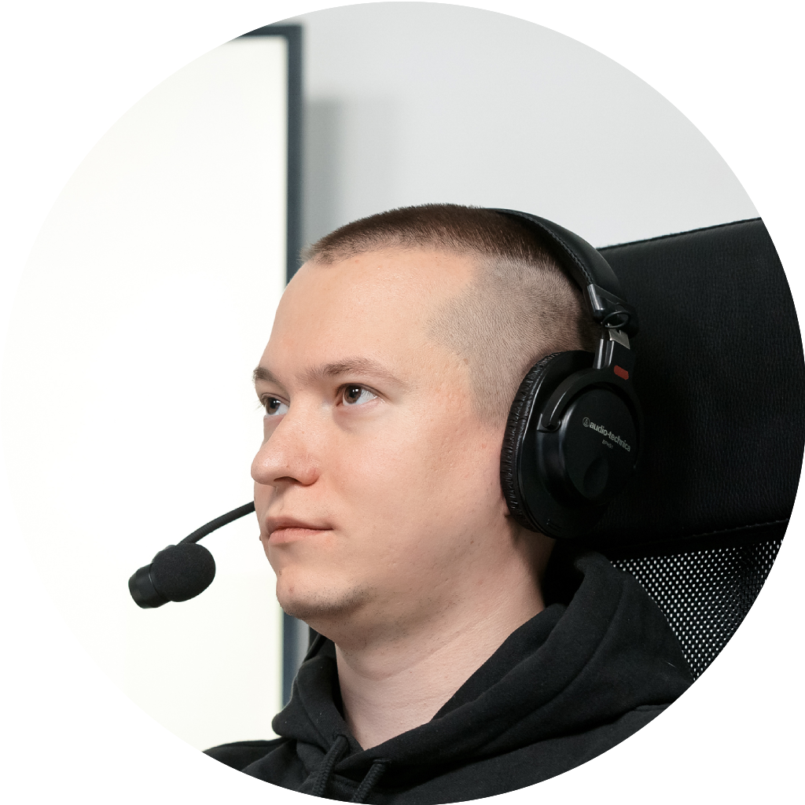

    
    <h1>Hi there 👋</h1>
    
My name is Mikhail Zotyev. I am a software engineer with deep expertise in Dart and Flutter as well as a lot of other technologies that I needed for solving problems, with experience in leading teams and departments.

    <h2>About me</h2>
    
🌍 Live in Bremen (Germany)

    
🙎🏻‍♂️ Pronouns: he, him

    
🇺🇳 Languages: RU (native), ENG (professional working), GER (beginner)

    
💬 Ask me about Flutter, Dart, Cross-platform

    
❤️‍🔥 Open Source

    
🎤 Public speaker, Mobius Program Committee

    
✍️ Tech writer

    
⚽️ Love sport, especially football

    
🎮 Crazy on video-games

    <h2>Tech stack</h2>
    

        
        
        
        
        
        
        
    

    

        
        
        
        
        
    

    

        
        
        
        
        
    

    

        
        
        
    

    

        
        
        
    

    

        
        
        
        
        
        
        
    

    <h2>Statistic</h2>
    
    
    
    
    

    <h2>Oh, my Flutter</h2>
    
I'm an author of the channel about Dart and Flutter - "Oh, my Flutter".

    
In the channel you can find news, articles, digests, announcements, vacancies and much more.

    
Content available on 2 languages (English and Russian) on 2 platforms (Telegram and Discord).

    

        <a href="https://t.me/ohmyflutter">
            

                
                
OMF

            

        </a>
        
        <a href="https://t.me/ohmyflutterENG">
            

                
                
OMF ENG

            

        </a>
        
        <a href="https://discord.com/invite/4b8aRVDMx7">
            

                
                
OMF Discord

            

        </a>
    

    <h2>My open source projects</h2>
    

        
    

    

        
    

    

        
    

    

        
    

    <h2>Articles</h2>
    <h4>Habr (RU)</h4>
    <a href="https://habr.com/ru/users/mbixjkee/posts/">List of articles</a>
    <h4>Medium (ENG)</h4>
    

    <h2>Public speakings</h2>
    

    <h2>Contact me</h2>
    
    
    
    
    

